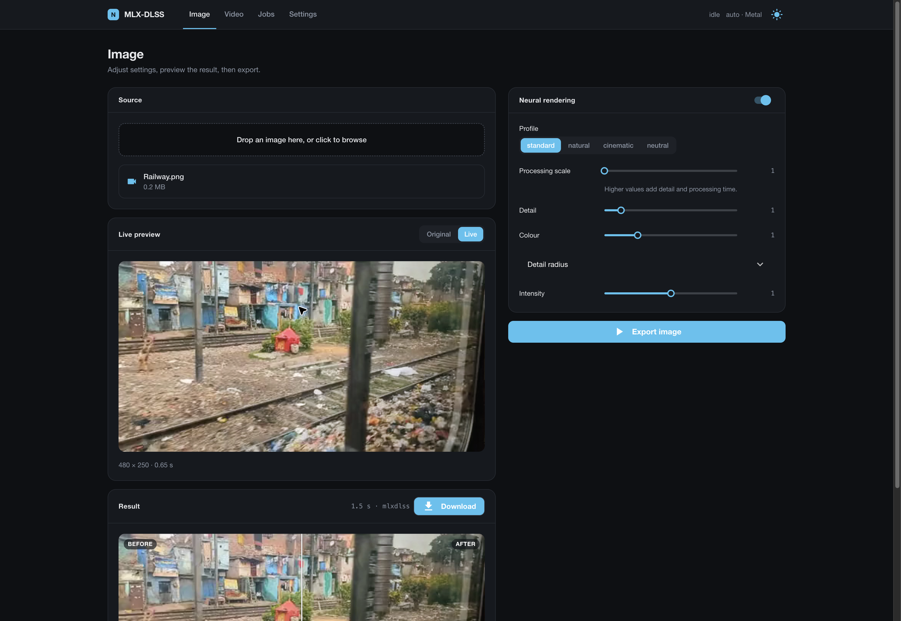
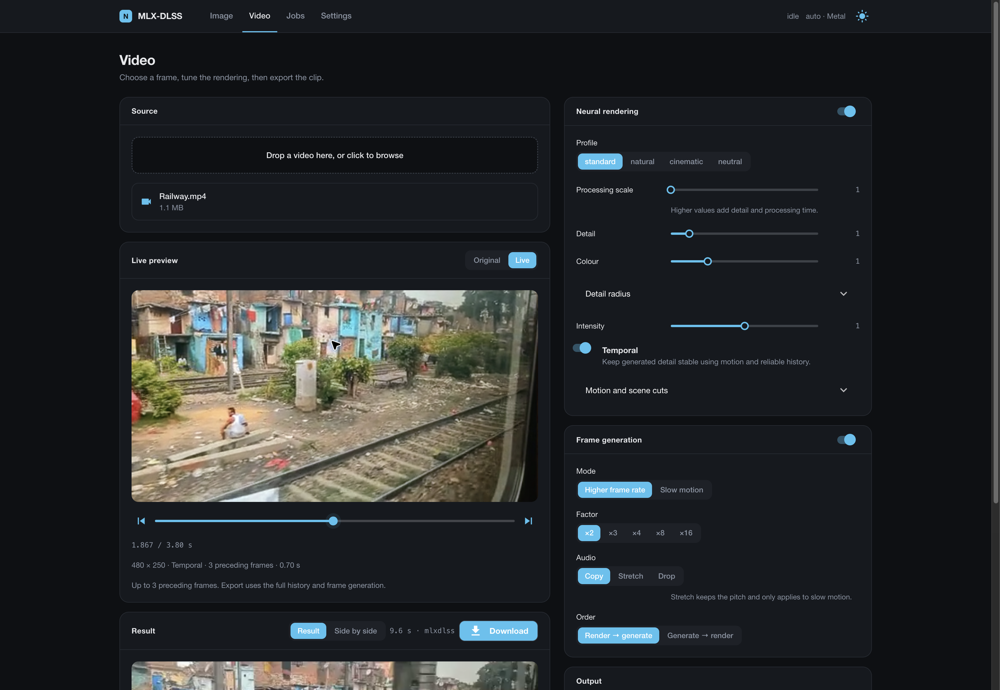
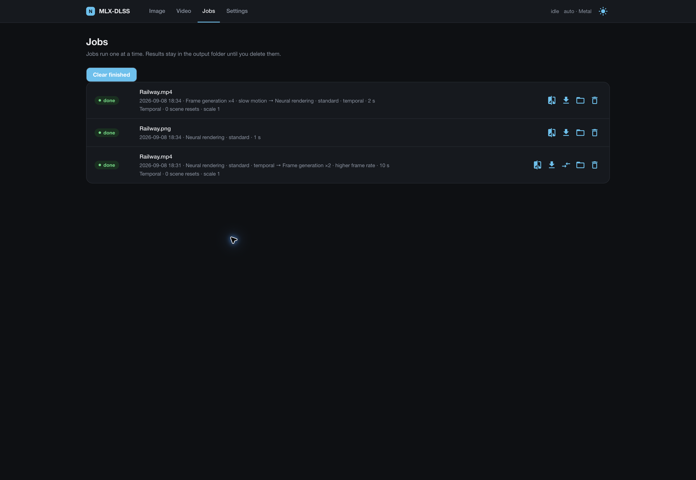

# MLX-DLSS

> [!TIP]
> **A note for the NVIDIA reader.** This port was worked out on a laptop and on
> GPU instances rented by the hour, some of which even booted. A pair of DGX
> Sparks would have replaced the rentals and would have a steady job here:
> experiments like this one, and the pet projects queued behind it. Hit me up on
> X: [@WaveCut](https://x.com/WaveCut).

**What this is.** NVIDIA ships two neural networks inside DLSS: the DLSS 5
neural renderer, which makes game frames look more photoreal (detail, colour,
tone), and the frame generator, which interpolates frames. Both are locked to
RTX cards and to games that call DLSS. This project runs them anywhere else:
on stills and video, on Apple Silicon first (MLX and Metal), on any machine
through PyTorch, and as a Core ML export.

**How it was done.** The networks were recovered from the libraries by reading
their kernels and comparing every intermediate tensor against captures from
the real thing. The neural renderer lands within 0.005 MAE of the DLL on game
renders; the frame generator matches the library at 59.9 dB. Half of the work
was not the math but the rounding: FP8, half floats, an approximate softmax
and a hash-based noise generator all had to be reproduced bit for bit.

**What you need.** Your own copies of `nvngx_dlssnr.dll` and
`libnvidia-ngx-dlssg.so`; the weight tool extracts the tensors locally.
Nothing proprietary is included, downloaded or redistributed.

**What it is not.** Not real-time in games, not a drop-in DLSS, not affiliated
with or endorsed by NVIDIA. DLSS Super Resolution was measured and
deliberately left out: without engine motion vectors it loses to plain Lanczos.


Neural rendering on a 1408×1600 game render, 1:1 crop: input, defaults, `--processing-scale 2 --detail-strength 2`.

https://github.com/user-attachments/assets/ce94f426-910b-4556-bdf9-662cbdd5933a

Frame generation: even frames in, generated frames out, the withheld frames for comparison.

## Requirements

- Native macOS app and video CLI: Apple Silicon, macOS 26+, Xcode with Swift 6.2+, CMake and Ninja. No Python, FFmpeg or web server is bundled or required at runtime.
- Metal tensor/image library: macOS 14+ with the same build tools.
- Optional Python tools (weight extraction, PyTorch and web UI): Python 3.10+; PyTorch is installed as a dependency.
- Python video adapter: `ffmpeg` and `ffprobe` in `PATH`; optical flow: `pip install './python[video]'`.
- Core ML packages: `pip install './python[coreml]'` (macOS or Linux).
- Web front end: `pip install './python[web]'`.

## Weights

| network | source file | command | output |
| --- | --- | --- | --- |
| neural rendering | `nvngx_dlssnr.dll` (file version 310.8.0.0, SHA-256 `ceb6432f…2650`) | `mlxdlss-weights all nvngx_dlssnr.dll weights/ [--coreml 320x320]` | `weights/dlssnr-weights-logical.safetensors` (PyTorch), `weights/NeuralRendering.dlssmodel` (Metal), `weights/NeuralRendering-WxH-float16.mlpackage` (Core ML) |
| frame generation | `libnvidia-ngx-dlssg.so.310.7.0` (DLSS SDK 310.7.0) | `mlxdlss-weights extract-fg libnvidia-ngx-dlssg.so.310.7.0 weights/framegen.safetensors` | `weights/framegen.safetensors` (both backends) |

`mlxdlss-weights sha256 FILE` reports whether a DLL is the supported build;
`mlxdlss-weights inspect PACKED` lists the tensors of an unknown version. The
DLL ships in NVIDIA's Streamline SDK package (`bin/x64/nvngx_dlssnr.dll`) and
with games that carry DLSS 5. Version numbers such as `dlssnr-logical-v18`
in the tool output are revisions of this project's decoder, not NVIDIA
releases; there is one supported DLL build.

## Install and build

Build and open the native SwiftUI app:

```sh
scripts/build-native-app.sh
open '.build/MLX DLSS.app'
```

Choose your existing `NeuralRendering.dlssmodel` package and FG safetensors in
the inspector, import media and start the queue. The app remembers weight and
output folders. It includes the native CLI and Metal library; weights remain
external. The weight-extraction commands above still use the optional Python
tools during initial preparation.

The **Live** view renders the selected image or video frame whenever rendering
settings change. Videos start at the first frame; use the timeline or frame
buttons to choose another. Rapid changes coalesce into the latest request and
reuse loaded weights. Temporal preview warms up to three preceding frames;
export uses the complete sequence. Frame generation runs during export.

For the Python/web workflow and a standalone Metal CLI:

```sh
python -m pip install './python[web,video]'
swift build -c release && scripts/prepare-mlx-metallib.sh "$(swift build -c release --show-bin-path)"   # macOS, Metal backend
```

The second command is required after every clean Swift build: it places
`mlx.metallib` next to the `mlxdlss` binary. MLX is the primary backend;
PyTorch runs the same graph on any machine; Core ML is an export with a fixed
extent.

## Commands

Native image and video processing (no Python or FFmpeg):

```sh
.build/release/mlxdlss process-image in.png --output out.png --model weights/NeuralRendering.dlssmodel --detail-strength 2
.build/release/mlxdlss process-video in.mp4 --output out.mp4 --model weights/NeuralRendering.dlssmodel --detail-strength 2
.build/release/mlxdlss process-video in.mp4 --output out.mp4 --model weights/NeuralRendering.dlssmodel --framegen-weights weights/framegen.safetensors --factor 2 --order nr-fg
```

Native video defaults to temporal rendering, VideoToolbox optical flow (Vision
fallback), hardware H.264 and audio. `--temporal off` disables history;
`--motion vision|videotoolbox|zero` selects motion explicitly. Other options:
`--scene-cut-threshold 0.3`, `--start-frame N`, `--frames N`, `--codec hevc|prores`
(ProRes needs MOV), `--bitrate BPS`, `--audio off`, `--order fg-nr`,
`--slow-motion on`. Slow motion preserves audio pitch. Original timestamps and
variable frame intervals are retained; FG writes `(N-1)×factor+1` frames.
JSON output includes stage timings, with progress on stderr. Existing output
files are preserved. Native video currently produces SDR 8-bit sRGB frames;
PNG/TIFF still exports retain 16-bit output. The Python adapter remains available
for custom FFmpeg filters, codec arguments and RGB16 video workflows.

Still images:

```sh
mlxdlss-torch run --weights weights/dlssnr-weights-logical.safetensors --input in.png --output out.png   # PyTorch: --device auto|cpu|cuda|mps, --precision reference|fast
.build/release/mlxdlss render-image in.png weights/NeuralRendering.dlssmodel --output out.png --execution metal-fused --precision float16
.build/release/mlxdlss render-image in.png weights/NeuralRendering-320x320-float16.mlpackage --output out.png --backend coreml --compute-units cpu-gpu
```

Core ML packages have a fixed extent: a 256×256 image runs on the 320×320
package, 1080p needs 1920×1088. Raw float32 NHWC tensors:
`mlxdlss run MODEL --input in.f32 --input-format rgb-first-frame --width W --height H --output out.f32`,
`mlxdlss-torch run --input in.f32 --width W --height H`.

Frame generation:

```sh
.build/release/mlxdlss framegen a.png b.png --weights weights/framegen.safetensors --output between.png   # --factor 3|4 writes between-1.png …; --phase 0.25
mlxdlss-video framegen in.mp4 out.mp4 --weights weights/framegen.safetensors                       # frame rate x2, audio copied
mlxdlss-video framegen in.mp4 out.mp4 --weights weights/framegen.safetensors --backend mlxdlss         # Metal through mlxdlss framegen-stream; --batch 4 pairs per pass
mlxdlss-video framegen in.mp4 slow.mp4 --weights weights/framegen.safetensors --mode slowmo --factor 4 --audio stretch
```

`--mode fps` multiplies the frame rate and keeps the duration; `--mode slowmo`
keeps the rate and stretches the clip. `--audio copy|stretch|none`: `stretch`
(slow motion only) uses FFmpeg `atempo`, pitch preserved.

Video through the neural renderer:

```sh
mlxdlss-video convert in.mp4 out.mp4 --backend mlxdlss --model weights/NeuralRendering.dlssmodel --temporal --encode-args "-c:v libx265 -crf 20 -preset slow"
mlxdlss-video convert in.mp4 out.mp4 --weights weights/dlssnr-weights-logical.safetensors --device cuda --processing-scale 2 --detail-strength 2
mlxdlss-video convert in.mp4 clip.mp4 --weights ... --start-frame 300 --frames 120 --decode-args "-vf scale=1280:-2"
mlxdlss-video probe in.mp4
mlxdlss-video compare in.mp4 out.mp4          # original | processed side by side in mpv
```

Temporal is enabled by default for new videos. It reprojects the previous
rendered output with OpenCV DIS optical flow and feeds that history into the
network, then blends with the learned history weight. Forward/backward flow
consistency, frame differences after reprojection, and image boundaries reject
unreliable history around occlusions. Scene changes reset history and noise;
`--scene-cut 0` disables automatic resets. These confidence checks are video
heuristics added by this port, not recovered NVIDIA behavior.

`--no-temporal` restores independent frames; `--motion zero` is a diagnostic
for static scenes. Temporal processes frames sequentially, ignoring `--batch`.
Both Metal and PyTorch support `--processing-scale 1–4`: history stays at the
processing resolution, while detail controls apply after downsampling to the
original output size. Python callers may supply engine motion as normalized
current-to-previous UV offsets and an optional H×W×1 confidence map in [0, 1].
Motion preparation for the next frame overlaps GPU rendering by default;
`--no-prefetch` disables the overlap for comparison. History and scene resets
still advance in frame order. Metal temporal video requires rebuilding the
Swift binary for stream protocol 4 (versions 1–3 remain accepted). Unscaled
8/16-bit source RGB uses its original integer format on the pipe; resampled
RGB, motion and confidence stay float32. Constant depth is reused. Downscale
and detail/colour composition now run on Metal before returning source-size
float32 RGB; at processing scale 4, the returned RGB payload is 16 times smaller.
History stays at the processing extent, before display composition.

Default
encoding: `-c:v libx264 -crf 18 -preset medium -pix_fmt yuv420p -movflags +faststart`;
`--pix-fmt rgb48le` keeps 16-bit sources; `--status-interval` seconds between
progress lines.

Web front end:

```sh
mlxdlss-web        # http://127.0.0.1:8181; --port, --no-browser, --native (pywebview window), --root DIR
```

Pages: Image (before/after slider), Video (effect chain: neural rendering and
frame generation in either order; the result plays in place, a side-by-side
comparison with the original is one click away), Jobs (queue, progress,
cancel, downloads), Settings (weight paths, backend, device, theme). Jobs run
one at a time; results are stored under `~/MLX-DLSS/outputs/<job>/`.
New video forms and API jobs with omitted `temporal` enable it automatically.
Saved jobs retain their settings, explicit `temporal: false` remains respected,
and still images keep their existing behavior. Completed video jobs show the
temporal reset count and processing scale.
Video effects share one decoder and one encoder in either order, with float32
frames between effects; no intermediate MP4 is created.
With both effects on Metal, temporal NR → FG automatically uses one native
process: float32 display frames pass directly into FG as MLX arrays. The final
frames are packed as RGB8 or RGB16 on Metal for the encoder. FG → NR, independent
NR frames, and mixed backends keep the existing float32 host path.
HTTP API: `GET /api/effects`, `POST /api/jobs` (multipart `file` + JSON
`effects`), `GET /api/jobs[/{id}]`, `POST /api/jobs/{id}/cancel`,
`GET /api/jobs/{id}/output/{n}` (inline), `GET /api/jobs/{id}/download/{n}`,
`GET /api/jobs/{id}/preview` (side by side).

<p>
  <a href="docs/assets/web-image.png"></a>
  <a href="docs/assets/web-video.png"></a>
</p>
<p>
  <a href="docs/assets/web-jobs.png"></a>
</p>

Image: a 1280×1440 face crop rendered on Metal in 4.6 s at processing scale 2,
detail 2; drag the divider. Video: the converted clip plays in place, «Side by
side» shows it next to the original. Jobs: every result with its download,
the comparison clip and the folder.

## Controls (neural rendering)

| option (`mlxdlss run` / `mlxdlss-torch run` / `mlxdlss-video convert`) | default | effect |
| --- | --- | --- |
| `--profile standard\|natural\|cinematic\|neutral` | `standard` | style index and local tone/structure preset |
| `--processing-scale 1–4` | `1` | run the network on the frame resampled by this factor (memory and time grow with its square) |
| `--detail-strength 0–8`, `--colour-strength 0–4`, `--detail-radius` | `1`, `1`, `4` | `result = input + colour·lowpass(change) + detail·highpass(change)` |
| `--intensity 0–1` | `1` | blend of the enhanced result over the input |
| `--control-mask rgb.f32` | none | red: blend, green: tone, blue: structure, per pixel |
| `--noise-frame-index` | `0` | deterministic noise seed; sessions advance it per frame |

## Python API

```python
from mlxdlss import NeuralRenderingPipeline, TemporalSession, FrameGenerator
pipeline = NeuralRenderingPipeline.from_safetensors("weights/dlssnr-weights-logical.safetensors", device="auto")
result = pipeline.enhance(image_float32_hwc, profile="standard", processing_scale=2, detail_strength=2)
session = TemporalSession(pipeline)           # frame sequences; session.process(frame[, motion=engine_uv_offsets])
generator = FrameGenerator.from_safetensors("weights/framegen.safetensors", device="auto")
middle = generator.generate(frame_a_uint8, frame_b_uint8, factor=2)[0]   # factor-1 frames at phases k/factor
```

## Accuracy and speed

| component | measurement |
| --- | --- |
| Neural rendering, Metal | `0.004–0.005` MAE against the NVIDIA DLL on 1152–1408 px game renders |
| Neural rendering, PyTorch | within `0.002` MAE of the Metal port; ~8 s per 1440×1280 frame on an M2 Max (MPS, reference graph) |
| Neural rendering, memory | PyTorch: about `1 GB` per megapixel of network input at float32 (1080p `2.0 GB`, 2560×2880 `5.5 GB`), half of that with `--precision fast`; the graph is evaluated in bounded chunks, so the peak does not depend on window count (`MLXDLSS_TORCH_CHUNK_TOKENS` sets the chunk, `0` disables). Metal: `2.2 GB` resident for a 3840×2160 frame |
| Neural rendering, Core ML | `0.008–0.014` MAE against the DLL |
| Temporal path | Swift and Python agree within `0.0014` MAE per frame; against NVIDIA on a 64-frame static sequence: `0.0054` MAE (`42.3` dB) with the same drift from frame 0 as the vendor; motion, jitter and mask cases not captured |
| Frame generation | reproduces the library's output at `59.9` dB PSNR (max 3/255) on captured frames; five whole clips within `0.01–0.03` dB of the library (27.4–38.9 dB against withheld frames) |
| Frame generation, stream (M2 Max, 960×540 / 1920×1080) | Metal float16, factor 2: `6.00–6.73 / 21.15–21.52` ms per generated frame at batch 1, `4.94–5.02 / 19.35–20.45` ms at batch 4, including RGB8 pipe I/O, excluding startup. [Paired measurements](docs/frame-generation.md#speed) |
| Temporal video, Metal (M2 Max) | a 228-frame 512×384, 60 fps clip with detail strength 2: `10.1–16.1 s`, versus `18.4–22.8 s` before these optimizations, including startup, optical flow, decode and encode |

These are local timing ranges with other desktop GPU applications running.
FG specializes Metal convolutions by channel count and epilogue, finishes
RGB8 quantization before synchronizing with the CPU, and writes the shared MLX
buffer directly to the pipe. The tested RGB8 and float32 outputs were byte-identical
to the previous implementation. Temporal video's alternating before/after
runs improved whole-clip time by about
`1.4×`. On 24-frame raw sequences at 512×384 (scales 1 and 2) and 1920×1080,
NR output differed from the previous implementation by at most `1.2e-7`;
prefetch on/off was bit-exact. Checkpoints, history and model precision are
unchanged. NR reuses scratch allocations within global-attention and FFN
stages while retaining the existing evaluation barriers and releasing the
cache at stage exit.

The GPU display/NR → FG path was also measured against `707d328` on M2 Max,
with the same real weights and 512×384 frames, float16 inference and detail
strength 2. Temporal NR including display composition and pipe I/O took
`133–138 ms` per input at processing scale 2 (previously `149 ms`), and
`418–420 ms` at scale 4 (previously `525–593 ms`). These are warm means over
16 frames after five warm-up frames, excluding decode, encode and motion
preparation. NR display differences stayed below `2.4e-7` in these runs.
See [NR → FG measurements](docs/frame-generation.md#gpu-video-chain) for the
combined path and its numerical comparison.
NR's fused blocks require float16; `--precision float32` keeps the reference
MLX graph even when `--execution metal-fused` is selected.

The native path uses AVFoundation/VideoToolbox and IOSurface-backed Metal
buffers for decoding, motion and encoding. Both NR → FG and FG → NR retain
float32 RGB between effects. In four alternating full runs of the same 228-frame
512×384 clip with detail 2, the new native global-attention/graph path took
**11.33–12.36 s (18.4–20.1 input fps)** versus 11.77–13.43 s with both disabled:
about 4–9% higher throughput in the two pairs. All four decoded RGB streams
had the same SHA-256. These include startup, motion, decode and encode and ran
with an empty executable search path. The new runs spent 0.37–0.48 s decoding
and encoding, 3.19–3.32 s on motion and 7.06–7.73 s on NR; peak process footprint
was 1.54–1.81 GB. Desktop load still varies, so these do not establish an exact
multiplier against historical runs from previous days.

On real weights, the new global-block path retains the vendor's half-precision
denominator, E4M3 publication and full spatial context. Short global sequences
use on-chip attention tiles and cached MLX graphs; larger sequences keep the
materialized path selected by the M2 Max measurements. Eight global blocks took
3.79 ms versus 4.85–5.51 ms at 48 tokens, and 21.59 ms versus 24.26–24.92 ms at
510 tokens, before graph caching; tested outputs matched exactly. Set
`MLXDLSS_STREAMED_GLOBAL_ATTENTION=0` or `MLXDLSS_COMPILE_GLOBAL=0` for comparisons.
Forcing streamed attention with `=1` above 512 tokens saves quadratic temporary
storage but was slower on M2 Max. [FG fusion measurements](docs/frame-generation.md#native-output-head-fusion)
cover the additional 18–22% warm FG throughput gain.

Experimental results on this M2 Max, kept out of the default path:

- Lossless FP8 weight packing matched the reference, but a tiled decode/GEMM
  prototype took 0.54–2.90 ms versus 0.25–0.84 ms for MLX half GEMMs. Packing
  single-head window intermediates halved their storage but gave no throughput
  win: three blocks at 1088×1920 took 50.97 ms versus 50.46–50.61 ms.
- Direct [ANEForge](https://github.com/sbryngelson/ANEForge) dispatch of the real
  1024→4096 projection took 0.30/0.51/1.04 ms for 48/192/768 tokens, excluding
  copies, versus roughly 0.27/0.35/0.73 ms on Metal. Maximum half-output error
  was 0.001. Core ML's compute plan selected ANE at 192 tokens, but its Python
  prediction boundary took 1.05 ms; at 48 tokens it selected CPU. These are layer
  probes, not timings or validation of the whole network on ANE.
- Reusing the global latent every other frame on 16 frames of the comparison
  clip introduced 0.0037–0.0072 mean RGB error (maximum 0.064). A linear latent
  correction did not fix it. This optimistic probe shared fresh encoder inputs
  and evaluated independent-frame rendering; a trained compact correction model
  would need a separate representative training/validation corpus and temporal
  quality gate. No learned replacement or stale feature cache is enabled.

Not included: DLSS Super Resolution (measured, loses to Lanczos on realistic
content without engine motion vectors and jitter; see the note below) and the
frame generator's motion-vector, depth, HUD and inpainting inputs (no-ops for
plain video).

## Documentation

- [Frame generation](docs/frame-generation.md): graph, verification, speed.
- [Super resolution](docs/super-resolution.md): measured, not ported.
- [Embedding guide](docs/embedding.md): the Swift API.
- [Recovery notes](docs/recovery-notes.md): package format, recovered graph, measured errors.
- [Research notes](docs/research/): kernel captures and the preprocessor.

## Development

```sh
scripts/verify.sh                                                  # Swift tests, Python tests, public-tree audit
python -m unittest discover -s python -t python -p 'test_*.py'     # Python package tests only
SWIFTPM_MAXIMUM_CONCURRENT_JOBS=2 swift test                       # Swift tests only
scripts/audit-public-tree.sh .                                     # no DLLs, weights or captures in the tree
```

CI runs the Swift suite on macOS and the Python package on macOS, Linux and
Windows. The audit rejects executable binaries, CUDA fatbins, DLL and weight
files, large unreviewed files and absolute home paths; `weights/` and `.build/`
are ignored and must never be committed. See [SECURITY.md](SECURITY.md),
[CONTRIBUTING.md](CONTRIBUTING.md), [PUBLICATION.md](PUBLICATION.md) and
[NOTICE](NOTICE).

## License

Apache License 2.0 for the source. Model packages built from vendor libraries
keep the vendor's terms; do not redistribute them.
